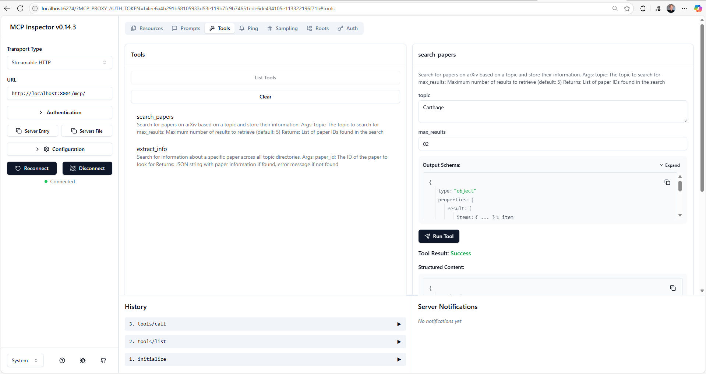

# MCP Remote Papers Research Server

A **Model Context Protocol (MCP)** server that provides comprehensive research capabilities for academic papers through arXiv integration. This server exposes tools for searching papers, extracting information, accessing organized resources, and generating research prompts.




## 🚀 Features

### 🔧 Tools
- **`search_papers`** - Search arXiv for papers on any topic and store their metadata
- **`extract_info`** - Retrieve detailed information about specific papers by ID

### 📁 Resources
- **`papers://folders`** - List all available research topic folders
- **`papers://{topic}`** - Access detailed paper information for specific topics

### 💡 Prompts
- **`generate_search_prompt`** - Generate comprehensive research prompts for Claude to analyze academic papers

### 🗂️ Data Organization
- Automatically organizes papers by topic in the `papers/` directory
- Stores paper metadata in JSON format for efficient retrieval
- Maintains persistent storage across server restarts

## 🌐 Deployment

This server is **ready for deployment** on any cloud provider including:
- AWS (EC2, Lambda, ECS)
- Google Cloud Platform (Compute Engine, Cloud Run)
- Microsoft Azure (Virtual Machines, Container Instances)
- DigitalOcean Droplets
- Heroku
- Railway
- Fly.io

The server runs on **port 8001** and uses **streamable HTTP transport** for maximum compatibility.

## 🛠️ Local Development & Testing

### Prerequisites
- Python 3.8+
- [uv](https://docs.astral.sh/uv/) package manager

### Installation Steps

1. **Clone the repository**
   ```bash
   git clone <repository-url>
   cd remote_mcp_server
   ```

2. **Create and activate virtual environment with uv**
   ```bash
   # Install uv if you haven't already
   curl -LsSf https://astral.sh/uv/install.sh | sh
   
   # Create virtual environment
   uv venv
   
   # Activate the virtual environment
   # On Windows:
   .venv\Scripts\activate
   # On macOS/Linux:
   source .venv/bin/activate
   ```

3. **Install dependencies**
   ```bash
   uv pip install -r requirements.txt
   ```

4. **Run the server**
   ```bash
   uv run research_server.py
   ```

### Testing with MCP Inspector

1. **Start the server** (in first terminal):
   ```bash
   uv run research_server.py
   ```

2. **Launch MCP Inspector** (in second terminal):
   ```bash
   npx @modelcontextprotocol/inspector
   ```

3. **Connect to the server**:
   - Server URL: `http://localhost:8001`
   - Transport: `streamable-http`

## 📖 Usage Examples

### Search for Papers
```python
# Search for machine learning papers
search_papers(topic="machine learning", max_results=10)
```

### Extract Paper Information
```python
# Get detailed information about a specific paper
extract_info(paper_id="2301.07041")
```

### Access Resources
```
# List available topic folders
papers://folders

# Access papers on a specific topic
papers://artificial_intelligence
```

### Generate Research Prompts
```python
# Create a comprehensive research prompt
generate_search_prompt(topic="quantum computing", num_papers=5)
```

## 📁 Project Structure

```
remote_mcp_server/
├── research_server.py      # Main MCP server implementation
├── requirements.txt        # Python dependencies
├── papers/                # Auto-generated paper storage
│   ├── topic_name/
│   │   └── papers_info.json
│   └── another_topic/
│       └── papers_info.json
└── README.md              # This file
```

## 🔧 Configuration

The server is configured with sensible defaults:
- **Port**: 8001
- **Transport**: streamable-http
- **Papers Directory**: `./papers`
- **Default Max Results**: 5 papers per search

## 📚 API Reference

### Tools

#### `search_papers(topic: str, max_results: int = 5) -> List[str]`
Searches arXiv for papers on a given topic and stores their metadata.

**Parameters:**
- `topic`: Research topic to search for
- `max_results`: Maximum number of papers to retrieve (default: 5)

**Returns:** List of paper IDs found

#### `extract_info(paper_id: str) -> str`
Retrieves detailed information about a specific paper.

**Parameters:**
- `paper_id`: ArXiv paper ID (e.g., "2301.07041")

**Returns:** JSON string with paper details or error message

### Resources

#### `papers://folders`
Lists all available research topic folders.

#### `papers://{topic}`
Provides detailed markdown-formatted information about papers in a specific topic.

### Prompts

#### `generate_search_prompt(topic: str, num_papers: int = 5) -> str`
Generates a comprehensive research prompt for Claude.

**Parameters:**
- `topic`: Research topic
- `num_papers`: Number of papers to analyze (default: 5)

## 🤝 Contributing

1. Fork the repository
2. Create your feature branch (`git checkout -b feature/amazing-feature`)
3. Commit your changes (`git commit -m 'Add amazing feature'`)
4. Push to the branch (`git push origin feature/amazing-feature`)
5. Open a Pull Request

## 📄 License

This project is licensed under the MIT License - see the [LICENSE](LICENSE) file for details.

## 🙏 Acknowledgments

- Built with [FastMCP](https://github.com/modelcontextprotocol/python-sdk)
- Powered by [arXiv API](https://arxiv.org/help/api) for academic paper access
- Compatible with the [Model Context Protocol](https://modelcontextprotocol.io/)

---

**Ready to revolutionize your research workflow?** 🚀 Deploy this server and start exploring the vast world of academic literature with AI-powered assistance!
